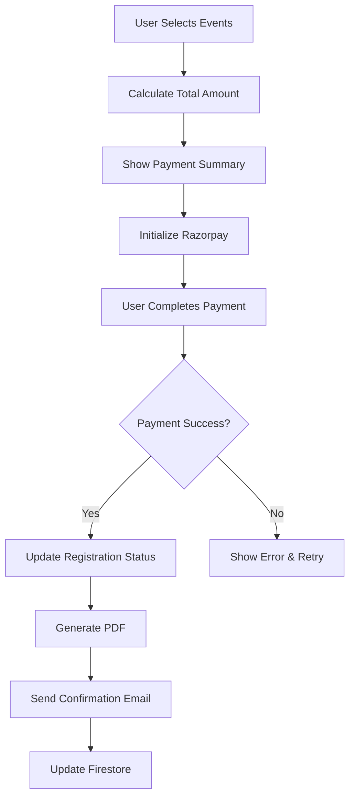

# ShuttleReg - Badminton Tournament App Architecture

## 📱 Project Overview
A comprehensive Android application for badminton tournament registration with automated age-based event selection, payment integration, and real-time tournament updates.

## 🏗️ Architecture Pattern
**Clean Architecture + MVVM** with the following layers:
- **Presentation Layer**: Jetpack Compose UI + ViewModels
- **Domain Layer**: Use Cases + Repository Interfaces
- **Data Layer**: Repository Implementations + Data Sources (Remote/Local)

## 📊 Database Design

### Firebase Firestore Collections

```
tournaments/
├── {tournamentId}/
    ├── name: String
    ├── description: String
    ├── startDate: Timestamp
    ├── endDate: Timestamp
    ├── venue: String
    ├── registrationDeadline: Timestamp
    ├── events: Array<String>
    ├── eventPrices: Map<String, Number>
    ├── rules: String
    ├── contactInfo: Map
    └── isActive: Boolean

users/
├── {userId}/
    ├── fullName: String
    ├── email: String
    ├── phone: String
    ├── dateOfBirth: Timestamp
    ├── gender: String
    ├── clubName: String?
    ├── profilePhotoUrl: String?
    ├── eligibleEvents: Array<String>
    ├── savedPartners: Array<PartnerInfo>
    └── createdAt: Timestamp

registrations/
├── {registrationId}/
    ├── userId: String
    ├── tournamentId: String
    ├── selectedEvents: Array<EventRegistration>
    ├── totalAmount: Number
    ├── paymentStatus: String
    ├── paymentId: String?
    ├── registrationDate: Timestamp
    ├── pdfUrl: String?
    └── status: String

eventRegistrations/
├── {eventRegId}/
    ├── registrationId: String
    ├── eventType: String (singles/doubles/mixed)
    ├── category: String (U-9, U-11, etc.)
    ├── partnerInfo: PartnerInfo?
    └── confirmed: Boolean

draws/
├── {tournamentId}/
    └── {eventCategory}/
        ├── matches: Array<Match>
        ├── bracket: Map
        └── lastUpdated: Timestamp

notifications/
├── {notificationId}/
    ├── title: String
    ├── message: String
    ├── tournamentId: String?
    ├── targetUsers: Array<String>
    ├── type: String
    ├── createdAt: Timestamp
    └── isRead: Boolean
```

### Room Database (Local Cache)

```kotlin
@Entity(tableName = "tournaments")
data class TournamentEntity(
    @PrimaryKey val id: String,
    val name: String,
    val description: String,
    val startDate: Long,
    val endDate: Long,
    val venue: String,
    val isActive: Boolean,
    val lastSynced: Long
)

@Entity(tableName = "user_registrations")
data class RegistrationEntity(
    @PrimaryKey val id: String,
    val tournamentId: String,
    val selectedEvents: String, // JSON
    val totalAmount: Double,
    val paymentStatus: String,
    val registrationDate: Long
)
```

## 🎯 Age Category Logic

```kotlin
object AgeCalculator {
    fun calculateEligibleEvents(dateOfBirth: LocalDate): List<EventCategory> {
        val birthYear = dateOfBirth.year
        val eligibleEvents = mutableListOf<EventCategory>()
        
        when {
            birthYear >= 2016 -> eligibleEvents.addAll(listOf(U9, U11, U13, U15, U17, U19))
            birthYear >= 2014 -> eligibleEvents.addAll(listOf(U11, U13, U15, U17, U19))
            birthYear >= 2012 -> eligibleEvents.addAll(listOf(U13, U15, U17, U19))
            birthYear >= 2010 -> eligibleEvents.addAll(listOf(U15, U17, U19))
            birthYear >= 2008 -> eligibleEvents.addAll(listOf(U17, U19))
            birthYear >= 2006 -> eligibleEvents.add(U19)
        }
        
        // Add Open categories for 18+ (born 2006 or earlier)
        if (birthYear <= 2006) {
            eligibleEvents.addAll(listOf(MENS_OPEN, WOMENS_OPEN))
        }
        
        return eligibleEvents
    }
}
```

## 🔄 Navigation Structure

```
App Navigation Graph:
├── Splash Screen
├── Authentication Flow
│   ├── Login Screen
│   ├── Register Screen
│   └── Forgot Password Screen
├── Main Flow
│   ├── Home Dashboard
│   ├── Tournament List
│   ├── Tournament Details
│   ├── Registration Flow
│   │   ├── Personal Details
│   │   ├── Event Selection
│   │   ├── Partner Details (if doubles)
│   │   ├── Summary & Confirmation
│   │   └── Payment
│   ├── Profile Management
│   ├── Registration History
│   ├── Tournament Updates
│   └── Live Draws & Results
```

## 💳 Payment Integration Flow



## 📄 PDF Generation Structure

```kotlin
class RegistrationPDFGenerator {
    fun generateRegistrationForm(
        user: User,
        tournament: Tournament,
        registration: Registration
    ): ByteArray {
        // Using iText7 to create professional tournament form
        // Include: Tournament logo, user details, selected events,
        // partner information, payment confirmation, QR code
    }
}
```

## 🔔 Push Notification System

```kotlin
class NotificationService : FirebaseMessagingService() {
    override fun onMessageReceived(remoteMessage: RemoteMessage) {
        // Handle different notification types:
        // - Tournament announcements
        // - Registration confirmations
        // - Match schedule updates
        // - Draw releases
        // - Live score updates
    }
}
```

## 🌐 Tournament Software Integration

```kotlin
interface TournamentSoftwareAPI {
    suspend fun getTournamentDraw(tournamentId: String): DrawResponse
    suspend fun getMatchResults(tournamentId: String): ResultsResponse
    suspend fun getLiveScores(matchId: String): LiveScoreResponse
}

class TournamentDataSyncWorker : CoroutineWorker() {
    override suspend fun doWork(): Result {
        // Periodic sync with tournament software
        // Update draws, results, and live scores
        // Send push notifications for updates
    }
}
```

## 🔐 Security Considerations

1. **Authentication**: Firebase Auth with email/phone verification
2. **Data Validation**: Server-side validation for all user inputs
3. **Payment Security**: Razorpay handles PCI compliance
4. **API Security**: Firebase Security Rules for Firestore access
5. **Local Storage**: Encrypted SharedPreferences for sensitive data

## 📱 UI/UX Design Principles

1. **Material 3 Design**: Modern, accessible interface
2. **Gradient Themes**: Badminton-inspired color schemes
3. **Progressive Disclosure**: Step-by-step registration flow
4. **Offline Support**: Cached data for poor connectivity
5. **Responsive Design**: Optimized for various screen sizes

## 🚀 Performance Optimization

1. **Lazy Loading**: Paginated tournament lists
2. **Image Optimization**: Coil for efficient image loading
3. **Background Processing**: WorkManager for sync operations
4. **Memory Management**: Proper lifecycle handling
5. **Network Optimization**: Retrofit with caching

## 📊 Analytics & Monitoring

1. **Firebase Analytics**: User behavior tracking
2. **Crashlytics**: Crash reporting and analysis
3. **Performance Monitoring**: App performance metrics
4. **Custom Events**: Registration funnel analysis

## 🔄 Development Workflow

1. **Version Control**: Git with feature branch workflow
2. **CI/CD**: GitHub Actions for automated builds
3. **Testing**: Unit tests, Integration tests, UI tests
4. **Code Quality**: Detekt for static analysis
5. **Documentation**: KDoc for code documentation

## 📦 Project Structure

```
app/src/main/java/com/example/shuttlereg/
├── data/
│   ├── local/
│   │   ├── database/
│   │   └── preferences/
│   ├── remote/
│   │   ├── api/
│   │   └── dto/
│   └── repository/
├── domain/
│   ├── model/
│   ├── repository/
│   └── usecase/
├── presentation/
│   ├── ui/
│   │   ├── auth/
│   │   ├── home/
│   │   ├── registration/
│   │   ├── profile/
│   │   └── tournament/
│   ├── viewmodel/
│   └── navigation/
├── di/
├── util/
└── MainActivity.kt
```

This architecture ensures scalability, maintainability, and follows Android development best practices while meeting all your tournament app requirements.